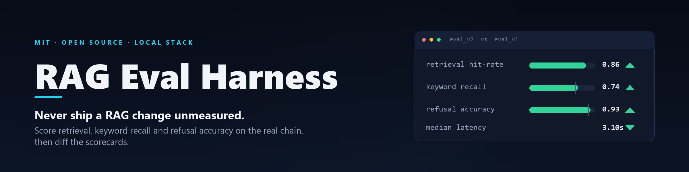
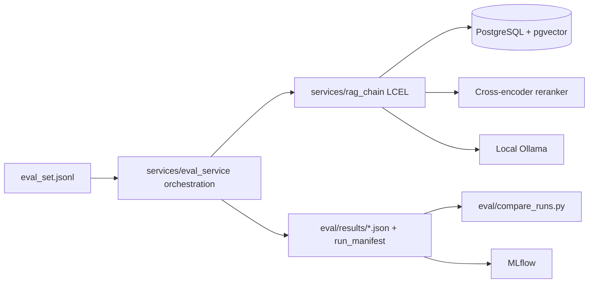

<p align="center">
  
</p>

<div align="center">

# RAG Eval Harness

### Never ship a RAG change unmeasured

[](https://github.com/samusafe/rag-eval-harness/actions/workflows/ci.yml)
[](#project-status)
[](#requirements)
[](#architecture)
[](LICENSE)

Run a fixed question set through your **real** RAG chain. Score retrieval, answer keyword recall, refusal accuracy and latency. Diff two runs and see whether the change actually helped.

**[Quick start](#quick-start)** · **[Architecture](#architecture)** · **[Metrics](#metrics)** · **[Provenance](#run-provenance)** · **[Another RAG over HTTP](#pointing-the-harness-at-another-rag-http-target)**

</div>

> [!WARNING]
> **This is not a factuality benchmark.** Every metric here is a deterministic, lexical regression signal — it tells you whether a change moved the system, not whether an answer is true. There is no LLM-as-judge, on purpose. Read [what these metrics are not](#what-these-metrics-are-not) before quoting a number anywhere.

## Why it exists

RAG has a lot of knobs that all sound plausible in isolation: swap the generator, tweak the prompt, change chunk size, fine-tune an adapter, add a reranker. Every one of them can silently make retrieval worse, recall worse, or hallucination more likely — while looking fine on the two questions you happened to try by hand.

**The rule this repo encodes: run the eval before the change, run it after, diff the scorecards.** If a change can't show its work in a scorecard, it doesn't ship.

## Highlights

| Capability | What it does |
| --- | --- |
| Scores the real chain | No mock LLM, no fixture answers — questions go through the same pgvector search, cross-encoder reranker, prompt and local Ollama model your app uses. |
| Anti-hallucination signal | `must_refuse` rows check that out-of-KB questions produce the exact refusal sentence and nothing else, so an answer-plus-refusal cannot pass. |
| Fail-closed eval set | Rows are strictly typed and validated; a malformed row aborts the run instead of silently shrinking the question set. |
| Provenance-aware scorecards | Manifest v2 records code/data hashes, corpus revision, model metadata, retrieval/generation knobs, packages and hardware. Unsafe comparisons stop by default. |
| Run-to-run diffing | `compare_runs.py` prints a summary delta and a per-question breakdown, regressions first, and warns when two runs used different embedders. |
| Live progress | A spinner over the slow startup, then a progress bar with the running question, elapsed time and ETA — a silent run is indistinguishable from a hung one. |
| Experiment tracking | Optional MLflow logging puts models, adapters and prompt versions side by side across many runs, not just the two most recent. |

## Architecture



```text
config.py                  Single source of truth for every env-driven setting
services/
  vector_store.py          pgvector connection + Ollama embeddings (singletons)
  rag_chain.py             Retriever + reranker + prompt + LLM (LCEL)
  rag_prompt.py            Prompt template, refusal sentence, context formatting (dependency-free)
  eval_set.py              Typed JSONL contract + fail-closed loader
  eval_metrics.py          Pure, dependency-free scorers + scorecard aggregate
  eval_manifest.py         Run provenance (git/host/package probes) + manifest builder
  eval_compat.py           Scorecard comparability (blocking/advisory provenance diffs)
  eval_service.py          Orchestration only: eval_one, write_results, log_mlflow
  gates.py                 CI/promotion gate thresholds (pure logic)
  bench_core.py            Pure tok/s math (no I/O)
eval/
  run_eval.py              CLI: run the eval, print a rich scorecard
  compare_runs.py          CLI: diff two or more scorecards
  bench_ollama.py          CLI: raw Ollama throughput benchmark
  eval_set.example.jsonl   Synthetic example question set
  results/                 Run output JSON (gitignored)
scripts/                   .ps1 / .sh twins for the above
tests/                     Offline tests — no live services required
```

Everything is local: Ollama for both the chat model and the embeddings. No cloud LLM provider anywhere in this repo.

## Quick start

### Requirements

- Python 3.11+
- A reachable [Ollama](https://ollama.com) with a chat model and an embedding model pulled
- PostgreSQL with the `pgvector` extension and a populated `rag_documents` collection
- an MLflow tracking server, only if you want `--mlflow` tracking (the lightweight
  client is already installed)

### 1. Install

<details open>
<summary>macOS / Linux</summary>

```bash
python -m venv .venv
source .venv/bin/activate
pip install -r requirements.txt
```

</details>

<details>
<summary>Windows PowerShell</summary>

```powershell
python -m venv .venv
.\.venv\Scripts\Activate.ps1
pip install -r requirements.txt
```

</details>

### 2. Configure

```bash
cp .env.example .env
```

Every value already has a localhost default in `config.py` — `.env` is only needed to override something. `Settings()` validates itself at import time and raises loud on a bad combination: a non-local `DATABASE_HOST` must set `DATABASE_SSLMODE` to `require`, `verify-ca` or `verify-full` (`prefer`/`allow`/`disable` all silently fall back to plaintext and are rejected) and must not use the default `ragpassword`; a non-local `MLFLOW_TRACKING_URI` needs `https` and `MLFLOW_ALLOW_REMOTE=true` (see [MLflow](#mlflow)).

### 3. Run the eval

```bash
python eval/run_eval.py
python eval/run_eval.py --model my-finetuned-model-v2 --mlflow   # A/B a different model
python eval/run_eval.py --collection <collection_id>             # scope to one collection
python eval/run_eval.py --preflight-only                         # validate the live stack cheaply
```

Gate a run in CI or a promotion pipeline — exit code `2` when any threshold is
missed, after the scorecard is written (a failed gate still leaves a full
result file to diff):

```bash
python eval/run_eval.py   --gate-hit-rate 0.8 --gate-recall 0.6 --gate-refusal 0.9 --gate-max-latency 8
```

Ten gate flags are available, each documented with `--help`:
`--gate-hit-rate`, `--gate-recall`, `--gate-refusal`, `--gate-max-latency`,
`--gate-max-p95-latency`, `--gate-exact-hit-rate`, `--gate-mrr`,
`--gate-answerability`, `--gate-citation-coverage`, `--gate-citation-validity`.

A gate on a metric the eval set cannot produce at all — `--gate-mrr` with no
`expected_source_ids` in any row, `--gate-refusal` with no `must_refuse` rows —
is refused **before the run starts**, exit code `2` with an explanatory usage
error, instead of running every question and only then reporting "produced no
data". Rates are rounded to 6 decimal places in the scorecard (not 3), so a
true 0.7998 cannot slip past a `--gate-hit-rate 0.8`.

This is also the hook for [qlora-8gb-pipeline](https://github.com/samusafe/qlora-8gb-pipeline):
run it against a freshly exported GGUF and a non-zero exit blocks the promotion.

### 4. Compare against a previous run

```bash
python eval/compare_runs.py --latest 2
python eval/compare_runs.py eval/results/<baseline>.json eval/results/<candidate>.json
```

`--latest N` picks the N most recent **runs**, ordered by the manifest's
`timestamp_utc` (falling back to file mtime for a pre-manifest scorecard) —
never by filename. Filenames start with the model name
(`eval_<model>_<hash>_<stamp>.json`), so a name sort is model-first, not
chronological, and could compare a model against itself or hide the newest run.

Comparison stops when quality-defining provenance differs. Use
`--allow-incompatible` only to inspect mismatched files while accepting that their
deltas are not causal. A scorecard with no `run_manifest` at all (pre-manifest)
is now also a **blocking** incompatibility, not a silent pass-through — it needs
`--allow-incompatible` too. A permissive run (`eval_set_strict: false` in the
manifest) is likewise always blocking, since it may have silently dropped rows.
A `corpus_revision` of `"unversioned"` on either side is only an advisory note.

For exactly two runs it also prints a per-question breakdown, **regressions
first** — that is where the debugging value is. It covers substring retrieval
hit, exact retrieval hit, reciprocal rank, keyword recall, refusal, answerability,
citation presence and citation validity; a per-question latency delta smaller
than `COMPARE_LATENCY_NOISE_S` (default 0.5s) is treated as noise and skipped.
Mean reciprocal rank is shown as a 3-decimal number, not a percentage. If the
two runs used different embedders it warns that retrieval hit-rate is not
comparable between them.

### 5. (optional) Benchmark raw Ollama throughput

```bash
python eval/bench_ollama.py --model my-finetuned-model --runs 5 --warmups 1 --out eval/results/bench.json
```

Shell wrappers ship for both platforms: `scripts/run_eval.ps1` / `scripts/run_eval.sh` and `scripts/compare.ps1` / `scripts/compare.sh`. The `.ps1` wrappers exit with the underlying Python process's exit code, so a failed gate (exit `2`) survives into a CI pipeline instead of being swallowed; `compare.ps1` forwards extra arguments (e.g. `--allow-incompatible`) alongside `-Latest`, not only in the explicit-file-list form.

> [!NOTE]
> Ctrl-C stops a run and writes **no** scorecard, on purpose: `compare_runs.py` treats every result file as a complete run, so a half-finished one would quietly read as a regression.

### What this repo does NOT include

This is the **evaluation harness**, not a full RAG service. There is no ingestion pipeline here (chunking, OCR, upload API) — you bring your own populated `pgvector` collection, or point `services/vector_store.py` at whatever vector store your stack already uses. The shipped eval set demonstrates the schema but is **not a meaningful runnable eval** until matching fictional handbook documents are ingested; normally, replace it with your own corpus and questions.

`--collection` is a `collection_id` metadata filter inside the fixed PGVector
collection `rag_documents`; it does not select a different PGVector collection.

## Eval set

One JSON object per line, in `eval/eval_set.example.jsonl`. Lines starting with `//` are comments.

| Field | Meaning |
| --- | --- |
| `id` | Short, unique label. Also the join key `compare_runs.py` diffs on |
| `question` | The user question |
| `expected_sources` | Substrings expected in a retrieved chunk's `source_file` metadata. Empty list = retrieval not scored |
| `expected_keywords` | Strings the answer should contain. Empty list = recall not scored |
| `must_refuse` | `true` for out-of-KB questions — the answer must be exactly the refusal sentence |
| `expected_source_ids` | Optional stable chunk/document IDs used for exact hit-rate and mean reciprocal rank |

Include several `must_refuse: true` rows — those are what catch hallucination, the highest-risk RAG failure mode.

### Strict by default

An eval set is a measuring instrument, so the loader is **fail-closed**: a bad row aborts the run instead of silently shrinking the question set, which would move every rate in the scorecard while the run still looked green. A row is rejected — naming file, line number and cause — when it:

- is not valid JSON;
- is missing a required field, or has the wrong type (no coercion: `"true"` is not `true`, `1` is not `"1"`);
- has a blank `id` or `question`;
- carries an unknown key (a typo like `expected_keyword` would otherwise score nothing, silently);
- reuses an `id` already seen in the file.

```bash
python eval/run_eval.py --permissive-eval-set   # log + skip bad rows instead
```

`--permissive-eval-set` exists only to investigate a broken file. It still raises when nothing valid is left, and its numbers are not comparable against a strict run.

## Metrics

Computed in `services/eval_metrics.py` (pure, stdlib-only scorers), printed by `eval/run_eval.py`. Each metric averages only over the rows where it applies, so a mixed eval set never dilutes either number.

| Metric | Target | Meaning |
| --- | ---: | --- |
| Retrieval hit-rate | >= 0.80 | A retrieved chunk's `source_file` contains one of the row's `expected_sources`, after reranking. |
| Exact hit-rate / MRR | dataset-specific | Exact `expected_source_ids` hit and reciprocal rank; requires stable ingestion IDs. |
| Answer keyword recall | >= 0.70 | Fraction of `expected_keywords` present in the answer, case-insensitive. |
| Refusal accuracy | >= 0.90 | For `must_refuse` rows, the whole answer is the configured refusal sentence. The anti-hallucination signal. |
| Answerability accuracy | dataset-specific | Penalizes exact refusal on answerable rows. |
| Citation coverage / validity | dataset-specific | Coverage = fraction of answerable rows whose answer cites at all (an uncited answer counts against coverage). Validity = fraction of a citing answer's headers that were actually supplied; an answer with **no** citations scores validity `None` (excluded from the average, not 0.0) since "didn't cite" is already captured by coverage. |
| Median / p95 latency | — | End-to-end wall time; retrieval and generation medians are also persisted. |

No baseline scorecard is published here on purpose: the numbers depend entirely on your corpus, embedder and generator, so a figure from this repo's synthetic set would be meaningless for yours.

### What these metrics are not

Being explicit about this matters more than the numbers themselves.

- **Keyword recall is lexical, not factual.** It checks that strings appear, not that the answer is true. *"The policy is **not** 20 days"* scores a full 1.0 against `["20 days"]`. Read it as "did the answer keep talking about the right things", never as a correctness score.
- **Retrieval hit-rate is substring matching over file names**, not exact chunk identity. It tolerates path and extension noise at the cost of possible coincidental matches. Prefer `expected_source_ids` when ingestion supplies stable IDs.
- **Refusal accuracy is exact, after light, deliberately narrow normalization only.** The entire answer must equal the refusal sentence; trailing newlines, doubled spaces, capitalization, typographic quotes (`'` `'` `"` `"` mapped to ASCII) and surrounding markdown emphasis (`**bold**`, `_italic_`) are forgiven, added words are not. A substring test would score *"The capital is Canberra. I don't have enough information in the knowledge base to answer this question."* as a correct refusal — grading a hallucination as anti-hallucination.
- **There is no LLM-as-judge.** Every metric is deterministic, so re-running the same set against the same model moves the numbers only when the system changed, not when the judge felt different.

## Run provenance

A score is only evidence if you can say what produced it. Every scorecard carries a `run_manifest`:

```json
{
  "run_manifest": {
    "schema_version": 3,
    "timestamp_utc": "2026-01-02T03:04:05Z",
    "git": { "commit_sha": "0123456789abcdef0123456789abcdef01234567", "dirty": false },
    "eval_set_sha256": "b9a2...",
    "eval_set_name": "eval_set.example.jsonl",
    "eval_set_strict": true,
    "chat_model": "my-finetuned-model-v2",
    "embedding_model": "nomic-embed-text",
    "reranker_model": "BAAI/bge-reranker-base",
    "retrieval": {
      "top_k": 20,
      "rerank_top_n": 5,
      "distance_strategy": "cosine",
      "collection_name": "rag_documents",
      "collection_id_filter": null,
      "corpus_revision": "handbook-2026-08"
    },
    "generation": { "temperature": 0.1, "num_ctx": 4096, "num_predict": 512 },
    "reranker": { "device": "cpu", "revision": "<pinned-HF-commit>" },
    "gates": { "retrieval_hit_rate": 0.8, "median_latency_s": 8.0 },
    "result_content_mode": "full",
    "runtime": {
      "packages": { "langchain-core": "1.6.0" },
      "gpus": ["NVIDIA GeForce RTX 4060 Laptop GPU, 8192"],
      "ollama_host_flags": {
        "OLLAMA_FLASH_ATTENTION": null,
        "OLLAMA_KV_CACHE_TYPE": null,
        "OLLAMA_NUM_PARALLEL": null
      },
      "ollama_chat_model": { "digest": "a2af...", "quantization_level": "Q4_K_M" }
    },
    "python_version": "3.11.9",
    "prompt_sha256": "7c31...",
    "config_sha256": "e0f4..."
  }
}
```

Note: `schema_version` above is the **manifest's own** version (currently 3); the
top-level scorecard's `schema_version` is a separate counter (currently 2) that only
bumps when a top-level key is added, not on a manifest-only change.

| Field | Why it earns its place |
| --- | --- |
| `git.commit_sha` / `git.dirty` | Which code ran, and whether it was a clean checkout. **`dirty: true` means the scorecard is not reproducible.** |
| `eval_set_sha256` / `eval_set_name` | The exact question-set bytes, and which file they came from. Two runs are only comparable when the hash matches. |
| `eval_set_strict` | Whether the loader ran fail-closed. A permissive run (`false`) may have silently dropped rows — `compare_runs.py` treats that as a blocking incompatibility. |
| `prompt_sha256` / `config_sha256` | Catches the silent killers — an edited prompt or a changed `RETRIEVAL_TOP_K` that would otherwise look like the model got better. |
| `gates` | The exact gate thresholds (if any) this run was checked against. |
| `result_content_mode` | Whether this scorecard's question/answer/source text is verbatim (`full`) or hashed (`redacted`). |
| `retrieval.collection_name` | The PGVector collection name (`PGVECTOR_COLLECTION_NAME`), not just the `collection_id` metadata filter. |
| `runtime.ollama_host_flags` | `OLLAMA_FLASH_ATTENTION` / `OLLAMA_KV_CACHE_TYPE` / `OLLAMA_NUM_PARALLEL`, read from config for provenance only — the harness never sets these itself. |
| `runtime.gpus` | `null` when `nvidia-smi` couldn't be queried at all (unknown), `[]` when it ran and found no GPU — the same unknown-vs-false distinction as `git.dirty`. |
| Models, `retrieval`, `generation`, `reranker`, `runtime` | Corpus/filter, inference settings, resolved packages, model digest/quantization and hardware. |

Set `CORPUS_REVISION` to an immutable ingestion release, dataset digest, or commit.
The default `unversioned` emits a warning because unchanged configuration cannot prove
that database contents stayed unchanged. Ollama tags are resolved at run time and their
digest and quantization are persisted. Dependency ranges are not a lockfile.

Pin `RERANK_MODEL_REVISION` to a Hugging Face commit SHA the same way: left blank it
means "unpinned", and `run_eval.py` prints a warning, because the reranker then
resolves to whatever the Hub's default branch currently points at — two runs may
silently use different weights.

## RTX 4060 / 8 GB profile

The conservative default keeps the 0.3B reranker on CPU (`RERANK_DEVICE=cpu`) so
its Python process does not compete with Ollama for scarce VRAM. Evaluation remains
sequential. An explicit output/prompt reserve bounds retrieved context, and each result
records estimated supplied tokens plus truncated or dropped chunks — the chars-per-token
estimate itself is `CHARS_PER_TOKEN_ESTIMATE` (default 4), not a hardcoded constant,
since Ollama tokenization is model-specific and not exposed through the chain. A
server-side `DATABASE_STATEMENT_TIMEOUT_MS` (default 30000) bounds every Postgres
statement, so a stalled pgvector scan fails loud instead of hanging the run.

The reranker uses a small direct `sentence-transformers` adapter, avoiding an
unnecessary wrapper; device, max sequence length, revision and batch size are explicit
configuration and provenance.

On the target GPU, benchmark CPU versus CUDA reranking and Ollama Flash Attention plus
`OLLAMA_KV_CACHE_TYPE=q8_0`; do not assume they improve a particular model without
running the same quality gates. Follow [GPU_VALIDATION.md](docs/GPU_VALIDATION.md).

Git metadata is **best-effort and never fatal**: running from a tarball, a container, or a machine without git yields explicit `null`s — `dirty: null` means *unknown*, not *clean* — rather than an error or a fabricated value. Both `git` and `nvidia-smi` are resolved via `shutil.which` (never a stray executable dropped into the checkout) and bounded by `HOST_PROBE_TIMEOUT` (default 2s); `runtime.gpus` is `null` when the probe couldn't run at all and `[]` when it ran and found no GPU. A scorecard from before the manifest existed has no `run_manifest` at all — `compare_runs.py` now treats that as a **blocking** incompatibility, not a silent pass-through; see [Compare against a previous run](#4-compare-against-a-previous-run).

## MLflow

`--mlflow` on `run_eval.py` and `bench_ollama.py` logs params, metrics and the scorecard JSON (manifest included) as an artifact to a local MLflow tracking server — `MLFLOW_TRACKING_URI`, default `http://localhost:5000`, under the `MLFLOW_EXPERIMENT_NAME` / `MLFLOW_BENCH_EXPERIMENT_NAME` experiments. Tracking failures are logged and never break the eval itself.

An eval run also carries a set of provenance tags — `eval_set_sha256`, `eval_set_name`,
`eval_set_strict`, `prompt_sha256`, `config_sha256`, `retrieval.corpus_revision`,
`git.commit_sha`, `git.dirty`, `embedding_model`, `reranker_model`,
`result_content_mode` — so a run's comparability can be judged from the MLflow UI
alone, without opening the artifact.

`MLFLOW_TRACKING_URI` is validated at startup: loopback (`localhost` / `127.0.0.1` /
`::1`) and non-HTTP stores (`file:`, `sqlite:`, a bare path) always work; any other
host must use `https` **and** set `MLFLOW_ALLOW_REMOTE=true`, or `Settings()` raises
before the run starts — scorecards carry verbatim questions and answers, so shipping
them to a remote tracking server is an explicit opt-in, not a default.

Scorecards contain questions, answers, and source names/IDs (`retrieved_sources`,
`retrieved_source_ids`). Set `RESULT_CONTENT_MODE=redacted` to store SHA-256 hashes
instead of question/answer text **and** of those retrieved source names/IDs — both are
corpus-identifying. Result files are created `0600` (results directory `0700`) on POSIX.
Use authenticated HTTPS for a remote MLflow server; localhost HTTP is not a safe remote
deployment configuration.

## Pointing the harness at another RAG (HTTP target)

Nothing about the scoring core is Ollama-specific. `eval_one` (in `services/eval_service.py`; the old name `_eval_one` is kept as an alias) needs exactly two things: a retriever with `.invoke(question) -> [docs with .metadata["source_file"]]`, and a chain with `.invoke({...}) -> str`. Adapt any RAG service behind an HTTP API by adding one module — keep the HTTP client in `services/`, never inline in a CLI script:

```python
# services/http_rag_target.py
"""Score somebody else's RAG service with this harness. One round-trip per
question, split into the retriever/chain pair `eval_one` drives."""
from __future__ import annotations

from dataclasses import dataclass

import httpx

from config import settings


@dataclass
class _Chunk:
    page_content: str
    metadata: dict


class HttpRagTarget:
    def __init__(self, base_url: str) -> None:
        self._client = httpx.Client(base_url=base_url, timeout=settings.OLLAMA_REQUEST_TIMEOUT)
        self._last: dict = {}

    def invoke(self, question: str) -> list[_Chunk]:
        """Retriever side — also caches the answer for the chain side."""
        response = self._client.post("/query", json={"question": question})
        response.raise_for_status()          # fail loud: a 500 is not a 0.0 score
        self._last = response.json()
        return [
            _Chunk(chunk.get("text", ""), {"source_file": chunk["source_file"]})
            for chunk in self._last.get("sources", [])
        ]

    def invoke_chain(self, _inputs: dict) -> str:
        return self._last.get("answer", "")
```

Then swap the three lines in `run_eval.py` that build the local chain:

```python
target = HttpRagTarget("http://localhost:8000")
retriever, chain = target, SimpleNamespace(invoke=target.invoke_chain)
```

Four caveats before trusting the output:

1. **Retrieval hit-rate needs the API to return its sources.** If yours only returns an answer, leave `expected_sources` empty and score keyword recall and refusal accuracy only — an unscored metric is honest, a fake one is not.
2. **Latency becomes the full remote round trip**, including that service's own queueing. Not comparable against local-chain runs.
3. **The refusal sentence must match.** Either make the remote service emit the sentence in `REFUSAL` verbatim, or change `REFUSAL` in `services/rag_prompt.py` to whatever contract that service promises. `REFUSAL` is interpolated directly into `RAG_PROMPT_TEMPLATE`, so changing it also changes `prompt_sha256` in the run manifest. Refusal accuracy measures adherence to a contract; there has to be one.
4. **Remove or guard the Ollama preflight.** `run_eval.py` unconditionally calls `fetch_ollama_metadata` for the chat and embedding model before building the chain (and again after the run, to refresh VRAM/quantization metadata), and raises if either model isn't installed in Ollama. Against a non-Ollama HTTP target those calls — and the post-run refresh — will fail preflight; remove or guard them in your copy of `run_eval.py` before pointing it elsewhere.

## Project status

| Area | Current state | Before relying on it elsewhere |
| --- | --- | --- |
| Eval, compare and bench flows | Implemented, offline-tested | Record a baseline scorecard against your own corpus and model. |
| Eval-set validation | Fail-closed and typed, every rejection path covered by tests | Migrate your own eval set — unknown keys are rejected by design. |
| Reproducibility | Manifest v2 and provenance-aware comparisons | Set immutable corpus/reranker revisions and adopt a reviewed lockfile before claiming bit-for-bit reproduction. |
| Metrics | Deterministic lexical and refusal metrics, no LLM-as-judge | Add exact-ID retrieval scoring via `expected_source_ids` if file-name matching is too loose for you. |
| CI and static checks | Ruff, mypy and pytest on every push and pull request | Add release automation and protected-branch rules. |
| Tests | Offline only, by design — no live services faked | Live-model runs stay a manual step against your own stack. |

## Development

```bash
pip install -r requirements-dev.txt
ruff check .        # lint  (ruff.toml)
python -m mypy      # types (mypy.ini)
python -m pytest
pip-audit -r requirements.txt
```

Type checking is deliberately pragmatic, not strict: mypy's default only checks annotated functions, which covers the typed core (eval-set loading, metrics, run manifest) without demanding a codebase-wide annotation pass. The one blanket exemption is `ignore_missing_imports` — the LangChain / Ollama / pgvector / MLflow stack ships no usable type information and has no stub packages.

CI (`.github/workflows/ci.yml`) runs lint, types, tests and a dependency audit on a
plain `ubuntu-latest` runner with **no live Ollama, Postgres or MLflow service**.
Python dependencies are still installed. It does **not** fake a passing end-to-end
pipeline or invent RAG scores.

## Design rules

The repo is small on purpose and stays that way: **KISS > SOLID > YAGNI**. One file, one responsibility. No new abstraction until the second real duplication. No `except` that swallows an error without re-raising or logging the cause. Every config value lives in `config.py` and nowhere else. Dependencies point inward: CLI scripts → `services/` → clients. The full set is in [CLAUDE.md](CLAUDE.md).

## Contributing

Issues and pull requests are welcome. Keep changes focused, add tests that run offline, and update this README whenever a public interface, metric definition or result-schema field changes.

## License

[MIT](LICENSE)

---

*Extracted and sanitized from LocalVault, a private on-premise AI platform I'm building.*
